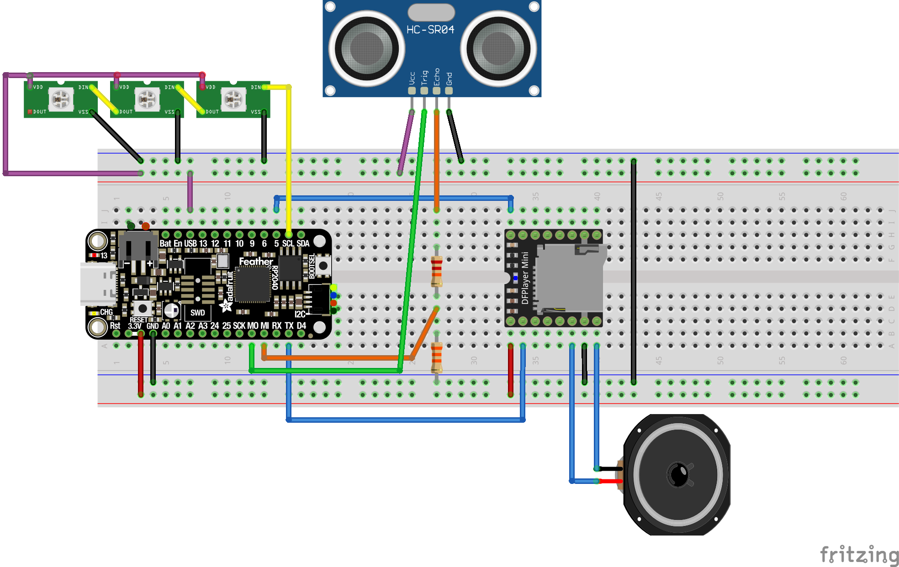

# HalloweenSkull
Cursed Skull for Halloween

This is a quick Halloween project: A resin skull (bought in a trinket store) is transformed into a spooked object that lights up and makes strange noises, especially when someone nears it.

You can find more details in a post in my blog:
https://raspico.blogspot.com/2024/10/halloween-with-micropython.html

